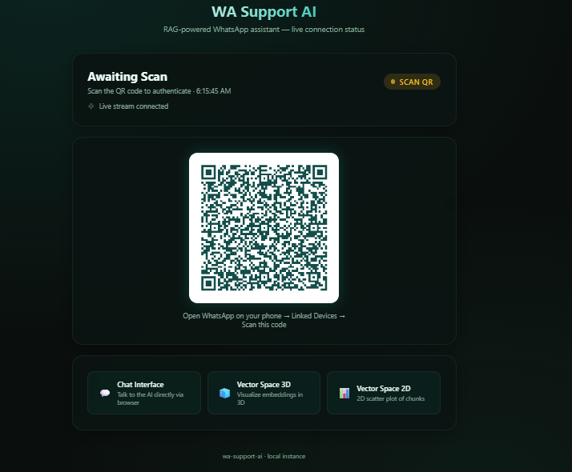
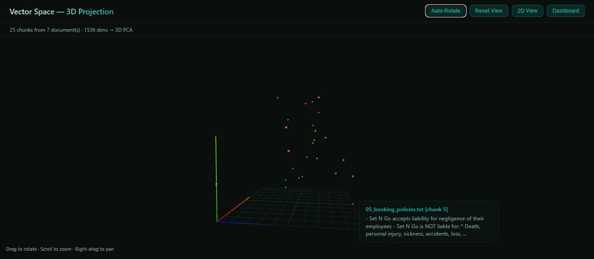
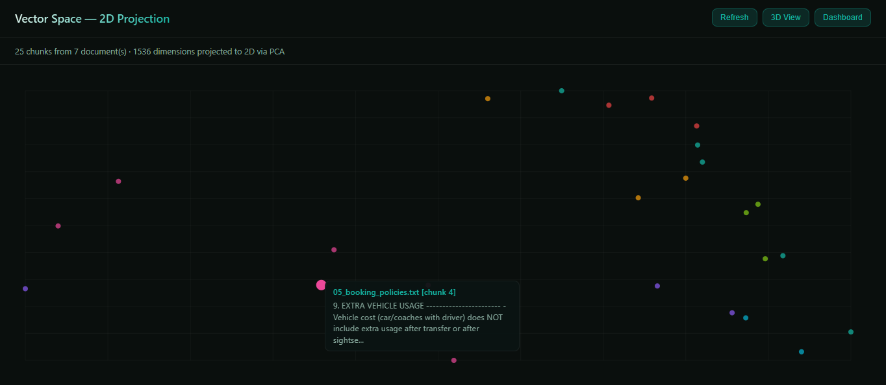

# WA Support AI - RAG

**A Retrieval-Augmented Generation (RAG) powered WhatsApp AI Assistant**

An AI-powered WhatsApp customer support assistant built with NestJS and RAG. It maintains a persistent WhatsApp Web session, ingests your knowledge base into vector embeddings, and uses context-aware generation to answer customer queries intelligently via WhatsApp.

## What is RAG?

**Retrieval-Augmented Generation (RAG)** is an AI architecture that combines information retrieval with text generation to produce accurate, grounded responses. Instead of relying solely on the LLM's training data, RAG retrieves relevant documents from your knowledge base at query time and feeds them as context to the model.

```
┌────────────────── RAG Pipeline ──────────────────┐
│                                                  │
│  1. RETRIEVE                                     │
│     User query → Embed → Vector search           │
│     Find the most relevant knowledge chunks      │
│                                                  │
│  2. AUGMENT                                      │
│     Inject retrieved context into the prompt     │
│     "Answer using ONLY this information..."      │
│                                                  │
│  3. GENERATE                                     │
│     LLM produces a grounded, cited response      │
│     based on actual knowledge base data          │
│                                                  │
└──────────────────────────────────────────────────┘
```

**Why RAG over fine-tuning?**
- No model retraining needed — just upload documents
- Always up-to-date — add/remove knowledge at any time
- Transparent — responses cite exact sources
- Cost-effective — works with any LLM (GPT-4o-mini, Claude, etc.)

Built for SetNGo Holidays — adaptable to any business.

> **Disclaimer:** **This project uses only publicly available data from the SetNGo Holidays website as a demonstration example. It is not an official product of SetNGo Holidays. The system prompt and knowledge base can be replaced with any business's data to build a similar AI assistant.**

## Screenshots

| Dashboard | 3D Vector Space | 2D Vector Space |
|-----------|-----------------|-----------------|
|  |  |  |

## Architecture

```
┌─────────────────────────────────────────────────────────────────┐
│                        WhatsApp (Customer)                       │
└────────────────────────────────┬────────────────────────────────┘
                                 │
                    ┌────────────▼────────────┐
                    │   WA Channel Module     │
                    │  (whatsapp-web.js)      │
                    └────────────┬────────────┘
                                 │
              ┌──────────────────▼──────────────────┐
              │           RAG Pipeline              │
              │                                    │
              │  ┌──────────┐  ┌───────────────┐  │
              │  │ Embedding │→ │ Vector Search │  │
              │  │ (OpenAI)  │  │  (MongoDB)    │  │
              │  └──────────┘  └───────┬───────┘  │
              │                        │          │
              │  ┌─────────────────────▼───────┐  │
              │  │     LLM (GPT-4o-mini)       │  │
              │  │  + Retrieved Context        │  │
              │  └─────────────────────────────┘  │
              └────────────────────────────────────┘
                                 │
              ┌──────────────────▼──────────────────┐
              │         MongoDB Atlas               │
              │  ┌────────────┐ ┌───────────────┐  │
              │  │  Chunks +  │ │ Conversations │  │
              │  │ Embeddings │ │   & Tickets   │  │
              │  └────────────┘ └───────────────┘  │
              └────────────────────────────────────┘
```

## Features

### Core
- **RAG-powered responses** — answers grounded in your uploaded knowledge base with source citations
- **WhatsApp integration** — persistent headless session via Puppeteer, QR-based auth, typing indicators
- **Document ingestion** — upload PDF, TXT, CSV, or Markdown; auto-chunked and embedded
- **MongoDB Atlas Vector Search** — native similarity search with cosine fallback for local dev
- **Automated ticket system** — AI creates support tickets when it can't resolve issues
- **Conversation logging** — full audit trail of every exchange with retrieved context and token usage

### AI Agent Capabilities
- Greets first-time customers automatically
- Answers from knowledge base with source citations
- Raises tickets: complaints, cancellations, update requests, callback requests
- Deduplicates tickets — checks existing open tickets before creating new ones
- Enforced boundaries — only responds to business-related queries

### Developer Tools
- **Web chat interface** — test the AI via browser at `/chat`
- **3D vector space visualization** — explore embeddings at `/embedding/visualize-3d`
- **2D vector space visualization** — scatter plot at `/embedding/visualize`
- **Swagger API docs** — full REST documentation at `/api/docs`
- **Real-time dashboard** — connection status + QR code at `/`

## Tech Stack

| Layer | Technology |
|-------|-----------|
| Framework | NestJS 11, TypeScript |
| LLM | OpenAI GPT-4o-mini via LangChain |
| Embeddings | OpenAI text-embedding-3-small (1536 dims) |
| Vector Search | MongoDB Atlas $vectorSearch |
| Database | MongoDB 7 / Mongoose |
| WhatsApp | whatsapp-web.js + Puppeteer |
| API Docs | Swagger UI |
| Containerization | Docker (multi-stage build) |

## Getting Started

### Prerequisites

- Node.js 20+
- MongoDB (local Docker or Atlas free tier)
- OpenAI API key
- A machine where Chromium can run (for WhatsApp Web)

### 1. Clone and install

```bash
git clone https://github.com/your-username/wa-support-ai.git
cd wa-support-ai
npm install
```

### 2. Start MongoDB (local development)

```bash
docker compose -f infra-setup/docker-compose.yml up -d
```

This starts MongoDB 7 on `localhost:27017` with Mongo Express GUI on `localhost:8081`.

### 3. Configure environment

```bash
cp .env.example .env
```

Fill in your values:

```env
PORT=3000
OPENAI_API_KEY=sk-...
OPENAI_MODEL=gpt-4o-mini
OPENAI_EMBEDDING_MODEL=text-embedding-3-small
MONGODB_URI=mongodb://localhost:27017/wa_support_ai
WA_SEND_API_USER=your-api-user
WA_SEND_API_PASS=your-api-pass
```

### 4. Start the application

```bash
npm run start:dev
```

### 5. Connect WhatsApp

Open `http://localhost:3000` and scan the QR code with your phone.

### 6. Ingest knowledge base

Upload documents via the API or Swagger UI:

```bash
curl -X POST http://localhost:3000/document/upload \
  -F "file=@your-document.pdf"
```

Embeddings are generated automatically after upload.

### 7. (Atlas only) Create vector search index

In MongoDB Atlas → Search → Create Index:

```json
{
  "type": "vectorSearch",
  "fields": [{
    "path": "embedding",
    "numDimensions": 1536,
    "similarity": "cosine",
    "type": "vector"
  }]
}
```

Index name: `autoembed_index` on collection `document_chunks`.

## API Reference

### WhatsApp Channel

| Method | Endpoint | Description |
|--------|----------|-------------|
| GET | `/wa-channel/status` | Connection status |
| GET | `/wa-channel/qr` | QR code as PNG |
| GET | `/wa-channel/events` | SSE stream (status + QR) |
| POST | `/wa-channel/send-message` | Send outbound message (auth required) |
| GET | `/wa-channel/users` | List unique users |
| GET | `/wa-channel/conversations/:phone` | Conversation history |
| GET | `/wa-channel/tickets` | List all tickets |

### Documents

| Method | Endpoint | Description |
|--------|----------|-------------|
| POST | `/document/upload` | Upload and ingest a document |
| GET | `/document` | List all documents |
| GET | `/document/:id/chunks` | View chunks |
| DELETE | `/document/:id` | Delete a document |

### Embeddings

| Method | Endpoint | Description |
|--------|----------|-------------|
| POST | `/embedding/process` | Embed all unprocessed chunks |
| POST | `/embedding/query` | Embed text (for testing) |
| GET | `/embedding/visualize` | 2D visualization |
| GET | `/embedding/visualize-3d` | 3D visualization |

### Chat (Browser)

| Method | Endpoint | Description |
|--------|----------|-------------|
| GET | `/chat` | Chat UI |
| POST | `/chat/send` | Send message (full response) |
| POST | `/chat/stream` | Send message (SSE stream) |

Full Swagger documentation available at `/api/docs`.

## Project Structure

```
src/
├── main.ts                          # Bootstrap + Swagger
├── app.module.ts                    # Root module
├── database/
│   ├── database.module.ts           # MongoDB connection
│   └── schemas/                     # Mongoose schemas
│       ├── document-chunk.schema.ts
│       ├── document-metadata.schema.ts
│       ├── conversation-log.schema.ts
│       └── ticket.schema.ts
├── wa-channel/                      # WhatsApp transport + AI handler
│   ├── wa-channel.module.ts
│   ├── wa-channel.service.ts        # Message handling, RAG integration, tickets
│   └── wa-channel.controller.ts     # REST + SSE endpoints
├── rag/                             # RAG orchestration
│   ├── rag.module.ts
│   └── rag.service.ts              # Query → Embed → Search → Generate
├── llm/                             # LLM provider (OpenAI via LangChain)
│   ├── llm.module.ts
│   └── llm.service.ts
├── embedding/                       # Vector embedding generation
│   ├── embedding.module.ts
│   ├── embedding.service.ts
│   ├── embedding.controller.ts
│   └── pages/                       # Visualization UIs
├── document/                        # Document ingestion pipeline
│   ├── document.module.ts
│   ├── document.service.ts
│   ├── document.controller.ts
│   ├── chunking/                    # Text splitting
│   └── loaders/                     # PDF, TXT, CSV parsers
├── chat/                            # Web chat interface
│   ├── chat.module.ts
│   ├── chat.service.ts
│   ├── chat.controller.ts
│   └── pages/
└── frontend/
    └── dashboard.controller.ts      # Main dashboard UI
```

## MongoDB Collections

| Collection | Purpose |
|-----------|---------|
| `document_chunks` | Chunked text with embedding vectors |
| `documents` | Document metadata (filename, size, status) |
| `conversation_logs` | Full message logs with RAG context |
| `tickets` | Support tickets (complaints, cancellations, etc.) |

## Deployment

### Docker

```bash
docker compose up -d --build
```

The app image uses a multi-stage build with Alpine + Chromium. WhatsApp sessions persist via Docker volumes.

### Environment

For production, use MongoDB Atlas for vector search and set `NODE_ENV=production`.

## Scripts

| Command | Description |
|---------|-------------|
| `npm run start:dev` | Development mode with hot reload |
| `npm run build` | Compile TypeScript |
| `npm run start:prod` | Run compiled build |
| `npm run lint` | ESLint with auto-fix |
| `npm run test` | Run unit tests |

## Message Flow

```
Customer sends WhatsApp message
  → Typing indicator shown
  → Load conversation history (last 10 messages)
  → Check existing open tickets (dedup)
  → Embed user query (OpenAI)
  → Vector search for relevant chunks (MongoDB Atlas)
  → Build augmented prompt (system prompt + context + history)
  → LLM generates response (GPT-4o-mini)
  → If response contains ticket JSON → create ticket in DB
  → Log conversation (user msg + AI response + sources + tokens)
  → Send response to customer
```

## License

UNLICENSED — private project.
